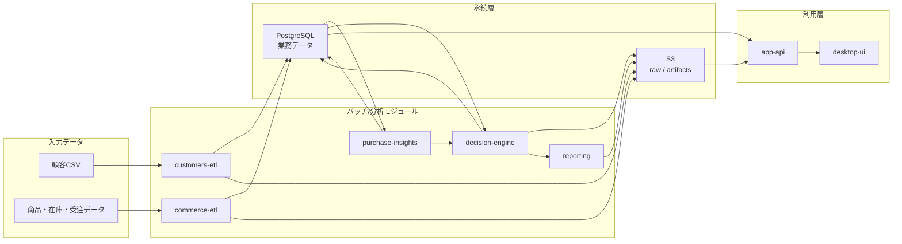

# 統合アーキテクチャ設計

## 1. この設計の目的

本設計は、Decision Pack を次の用途に耐える構成へ拡張するための現行方針を定めるものです。

- 顧客CSVを整形し、永続化する
- 商品品目、購入履歴、在庫を一貫して扱う
- 顧客ごとの次回購入候補を確率的に推定する
- 需要予測を踏まえて在庫リスクを評価する
- GUI を薄いクライアントに寄せ、将来は AWS 上の API とジョブ基盤を使う

## 2. 設計原則

- `decision-engine` は意思決定計算専用とし、顧客個票の管理や一覧検索の責務を持たせない
- 顧客整形、業務データ取込、購入傾向推定、意思決定計算、GUI/API は別モジュールに分ける
- GUI は AWS の個別サービスを直接叩かず、必ず `app-api` を介して情報を取得する
- 顧客個票は分析系で扱い、`decision-engine` へ渡すのは `item_id` 単位の集約済み需要情報だけにする
- ドキュメントの正本は `docs/` 配下に置く

## 3. 推奨するモノレポ構成

```text
decision-pack/
  docs/
    architecture/
    archive/
  customers-etl/
  commerce-etl/
  purchase-insights/
  decision-engine/
  app-api/
  desktop-ui/
  reporting/
  spec/
  data/
```

### 3.1 各モジュールの責務

- `customers-etl`
  - 顧客CSVの正規化
  - 顧客マスタとロード問題ログの生成
- `commerce-etl`
  - 商品品目、在庫、受注、受注明細の取込
  - 業務DB向けの基本テーブル生成
- `purchase-insights`
  - 顧客ごとの次回購入候補推定
  - 品目別需要予測の集約生成
- `decision-engine`
  - 在庫、需要、資金制約を入力にした意思決定計算
  - 欠品、在庫日数、補充提案、資金影響の算出
- `app-api`
  - GUI 向け API
  - 読み取り系クエリとジョブ起動の窓口
- `desktop-ui`
  - 顧客一覧、購入履歴、購入傾向、在庫状況、シミュレーション結果の表示
- `reporting`
  - `decision-engine` の JSON 出力を図表やテキストへ変換
- `spec`
  - 仕様の正本

## 4. 全体構成図



## 5. データ境界

### 5.1 `customers-etl` が持つ境界

- 入力: 顧客CSV
- 出力:
  - `customers`
  - `customer_load_issues`
  - 必要に応じて `customer_segment_summary`

ここでは顧客の正規化と品質管理だけを行います。

### 5.2 `commerce-etl` が持つ境界

- 入力: 品目リスト、在庫元帳、受注データ、受注明細
- 出力:
  - `items`
  - `inventory_balance`
  - `inventory_movements`
  - `orders`
  - `order_items`

ここで「誰が何を買ったか」を初めて明確に持てます。顧客CSVだけではこの情報は得られません。

### 5.3 `purchase-insights` が持つ境界

- 入力:
  - `customers`
  - `orders`
  - `order_items`
  - `items`
- 出力:
  - `customer_item_next_buy_score`
  - `item_demand_forecast`

顧客ごとの推薦結果と、`decision-engine` が使う品目別需要予測をここで分離して作ります。

### 5.4 `decision-engine` が持つ境界

- 入力:
  - `inventory_balance`
  - `item_demand_forecast`
  - `item_policy`
  - `cashflow` 系データ
- 出力:
  - `simulation_runs`
  - `simulation_item_results`
  - `simulation_report_v0.1` JSON

`decision-engine` は個別顧客IDや受注明細を直接扱いません。

## 6. PostgreSQL の最小論理設計

### 6.1 顧客系

- `customers`
- `customer_load_issues`

### 6.2 商品・在庫・受注系

- `items`
- `inventory_balance`
- `inventory_movements`
- `orders`
- `order_items`

### 6.3 分析・予測系

- `customer_item_next_buy_score`
- `item_demand_forecast`

### 6.4 シミュレーション系

- `simulation_runs`
- `simulation_item_results`

### 6.5 ジョブ管理系

- `etl_job_runs`

## 7. モジュールAの正式化

本設計では、モジュールAを `purchase-insights` と呼びます。

### 7.1 役割

- 顧客ごとの購入履歴を集約する
- 次に買う可能性が高い品物を確率的に算出する
- 推薦結果を、`decision-engine` が使える品目需要予測へ集約する

### 7.2 最初のアルゴリズム

最初は説明可能で運用しやすい方法から始めます。

- 再購入確率
  - 直近購入日、購入回数、平均購入間隔を使う
- 商品遷移確率
  - ある商品を買った後に次に買いやすい商品を集計する
- セグメント人気
  - 顧客属性や全体人気で補正する

最終スコアは次の重み付き和で作ります。

```text
next_buy_score
  = w1 * repeat_probability
  + w2 * transition_probability
  + w3 * segment_popularity
```

### 7.3 出力契約

- 顧客向け:
  - `customer_id`
  - `item_id`
  - `score`
  - `rank`
  - `as_of`
- `decision-engine` 向け:
  - `date`
  - `item_id`
  - `expected_qty`
  - `low_qty`
  - `high_qty`
  - `as_of`

## 8. GUI の機能整理

GUI は薄いラッパに寄せ、表示と操作に専念させます。

### 8.1 顧客画面

- 顧客一覧
- 顧客詳細
- 購入履歴一覧
- 次回購入候補 Top-N

### 8.2 在庫画面

- 品目ごとの在庫一覧
- 在庫ステータスの絞り込み検索
- 欠品リスク、過剰在庫リスク、推奨補充量の表示

### 8.3 シミュレーション画面

- シナリオ実行
- 実行履歴一覧
- KPI とアラート表示
- レポート成果物表示

## 9. API 設計

### 9.1 読み取り系 API

- `GET /customers`
- `GET /customers/{customer_id}`
- `GET /customers/{customer_id}/purchases`
- `GET /customers/{customer_id}/next-buy`
- `GET /items`
- `GET /items/{item_id}`
- `GET /items/{item_id}/inventory`
- `GET /items/{item_id}/risk`
- `GET /simulations`
- `GET /simulations/{run_id}`
- `GET /simulations/{run_id}/report`

### 9.2 実行系 API

- `POST /jobs/customers-etl`
- `POST /jobs/commerce-etl`
- `POST /jobs/purchase-insights`
- `POST /simulations`

### 9.3 API の原則

- GUI はこの API しか見ません
- API は DB と S3 とジョブ起動の調停役です
- 長時間処理は同期応答で完了を待たず、`job_id` や `run_id` を返します

## 10. AWS での配置

### 10.1 推奨構成

- `S3`
  - 生データと成果物の保管
- `RDS for PostgreSQL`
  - 業務データと分析結果の保管
- `API Gateway`
  - GUI の入口
- `Lambda`
  - 軽い API ハンドラ
- `Step Functions`
  - ジョブオーケストレーション
- `ECS/Fargate`
  - `customers-etl`, `commerce-etl`, `purchase-insights`, `decision-engine` の実行
- `EventBridge Scheduler`
  - 夜間バッチ起動
- `CloudWatch`
  - ログと障害監視

### 10.2 なぜこの構成にするか

- GUI を薄いクライアントに保てる
- ETL や `decision-engine` を長時間バッチとして扱える
- 再実行、監査、失敗追跡をしやすい
- 将来の負荷増加に対応しやすい

## 11. 実装フェーズ

### フェーズ 1

- `commerce-etl` を追加する
- `items`, `orders`, `order_items`, `inventory_balance` を PostgreSQL へ入れる
- `app-api` の読み取り系 API を作る
- GUI で顧客一覧、購入履歴、在庫一覧を表示する

### フェーズ 2

- `purchase-insights` を追加する
- `customer_item_next_buy_score` を nightly batch で作る
- GUI に購入傾向と次回購入候補を出す

### フェーズ 3

- `decision-engine` を `item_demand_forecast` 入力対応に拡張する
- 在庫リスクと補充提案を GUI に統合する

### フェーズ 4

- `customers-etl`, `commerce-etl`, `purchase-insights`, `decision-engine` を AWS ジョブへ移す
- GUI を AWS API 利用前提へ切り替える

## 12. 実装チケットの粒度

### 12.1 データ基盤

1. `items` と `inventory_balance` のスキーマ定義
2. `orders` と `order_items` のスキーマ定義
3. PostgreSQL migration 基盤の追加
4. `customers-etl` の PostgreSQL 永続化
5. `commerce-etl` の初版実装

### 12.2 API/GUI

1. `app-api` の雛形作成
2. 顧客一覧 API
3. 購入履歴 API
4. 在庫一覧 API
5. 在庫絞り込み検索 API
6. GUI の API クライアント層追加
7. GUI の顧客画面追加
8. GUI の在庫画面追加

### 12.3 推薦/需要予測

1. `purchase-insights` の特徴量設計
2. 再購入確率の初版実装
3. 商品遷移確率の初版実装
4. `customer_item_next_buy_score` 生成ジョブ
5. `item_demand_forecast` 集約ジョブ

### 12.4 意思決定支援

1. `decision-engine` の入力契約拡張
2. 需要予測対応の在庫計算追加
3. 在庫リスクと補充提案の出力追加
4. `simulation_report_v0.1` の拡張

### 12.5 AWS

1. `app-api` の Lambda 化
2. ジョブ起動 API と `job_id` 追跡
3. `ECS/Fargate` 実行基盤
4. `Step Functions` の状態機械
5. `EventBridge Scheduler` の夜間実行

## 13. 今すぐ変えないこと

- `decision-engine` に顧客個票を入れない
- GUI から DB や S3 を直接読まない
- 顧客推薦ロジックを最初から複雑な機械学習にしない
- 既存の `simulation_report_v0.1` 契約を不用意に壊さない
