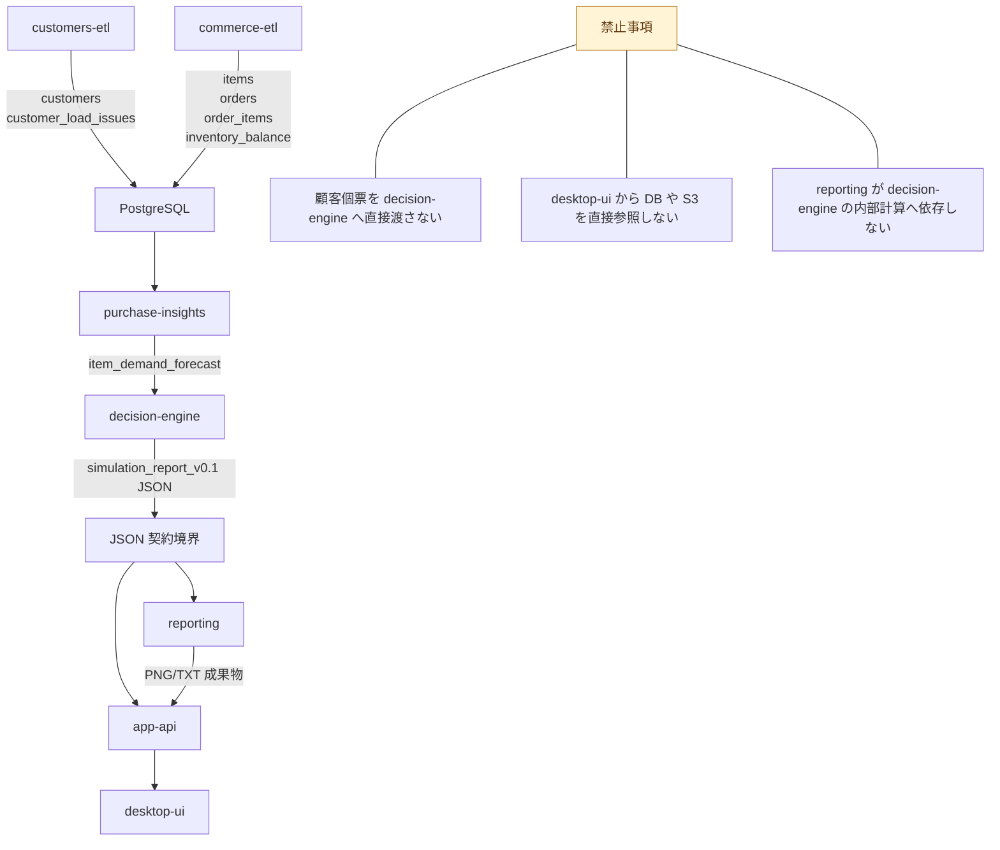

# モジュール責務と境界

この文書は、これから採用するモジュール構成において、各モジュールが何を担当し、どこで境界を切るかを俯瞰するための設計メモです。

## 1. 全体の責務分割

```mermaid
flowchart LR
    subgraph Inputs["入力データ"]
        CustomersRaw["顧客CSV"]
        CommerceRaw["商品・在庫・受注データ"]
    end

    subgraph Monorepo["Decision Pack"]
        direction LR

        subgraph CustomersEtl["customers-etl\n顧客データ前処理"]
            CustomersNormalize["正規化"]
            CustomersPersist["永続化"]
        end

        subgraph CommerceEtl["commerce-etl\n商品・在庫・受注取込"]
            CommerceNormalize["正規化"]
            CommercePersist["永続化"]
        end

        subgraph Insights["purchase-insights\n購入傾向分析"]
            InsightsFeatures["特徴量作成"]
            InsightsScore["次回購入候補推定"]
            InsightsForecast["品目需要予測集約"]
        end

        subgraph Engine["decision-engine\n意思決定支援"]
            EngineIo["入力整形"]
            EngineSim["在庫・資金計算"]
            EngineReport["レポート出力"]
        end

        subgraph Reporting["reporting\n図表生成"]
            ReportingCli["CLI"]
            ReportingCharts["図表生成"]
        end

        subgraph Api["app-api\nGUI 向け API"]
            ApiRead["読み取り API"]
            ApiJobs["ジョブ起動 API"]
        end

        subgraph Ui["desktop-ui\nIced GUI"]
            UiCustomers["顧客画面"]
            UiItems["在庫画面"]
            UiSim["シミュレーション画面"]
        end

        subgraph Spec["spec\n形式仕様"]
            LeanSpec["Lean 仕様"]
        end
    end

    CustomersRaw --> CustomersNormalize
    CustomersNormalize --> CustomersPersist

    CommerceRaw --> CommerceNormalize
    CommerceNormalize --> CommercePersist

    CustomersPersist --> InsightsFeatures
    CommercePersist --> InsightsFeatures
    InsightsFeatures --> InsightsScore
    InsightsScore --> InsightsForecast
    InsightsForecast --> EngineIo

    EngineIo --> EngineSim
    EngineSim --> EngineReport
    EngineReport --> ReportingCli
    ReportingCli --> ReportingCharts

    EngineReport --> ApiRead
    ReportingCharts --> ApiRead
    ApiRead --> UiCustomers
    ApiRead --> UiItems
    ApiRead --> UiSim
    ApiJobs --> UiSim

    LeanSpec -.-> EngineSim
```

## 2. 境界の原則

## 3. モジュール別の責務

### `customers-etl`

- 顧客CSVの復旧、正規化、品質管理
- 顧客データの永続化
- 顧客ロード時の問題記録

### `commerce-etl`

- 商品品目、受注、受注明細、在庫の取込
- 業務DB向けの基本テーブル生成

### `purchase-insights`

- 顧客ごとの購入履歴集約
- 次回購入候補 Top-N の推定
- `decision-engine` 用の品目需要予測集約

### `decision-engine`

- 品目需要、在庫、資金制約を入力にした計算
- 在庫リスク、補充提案、資金影響の算出
- レポート JSON の出力

### `reporting`

- レポート JSON から図表と要約テキストを生成

### `app-api`

- GUI へ統一された読み取り API を提供
- ETL、分析、シミュレーションのジョブ起動口になる

### `desktop-ui`

- 顧客、在庫、シミュレーション結果の表示
- API 呼び出しと状態表示

### `spec`

- 仕様の正本
- 制約、不変条件、意味の記述

## 4. 依存方向

- `customers-etl` は `decision-engine` に依存しない
- `commerce-etl` は `decision-engine` に依存しない
- `purchase-insights` は `decision-engine` の内部実装に依存しない
- `reporting` は `simulation_report_v0.1` JSON 契約にのみ依存する
- `desktop-ui` は `app-api` にのみ依存する
- `spec` は実行時依存ではなく、設計と検証の基準である

## 5. AWS 化を見据えた読み替え

- `desktop-ui` は薄いクライアントのまま保つ
- `customers-etl`、`commerce-etl`、`purchase-insights`、`decision-engine` はジョブとして AWS 側へ移せるようにする
- `app-api` は GUI と AWS 内部サービスの境界になる
- `simulation_report_v0.1` JSON は API/Reporting 境界に残す
